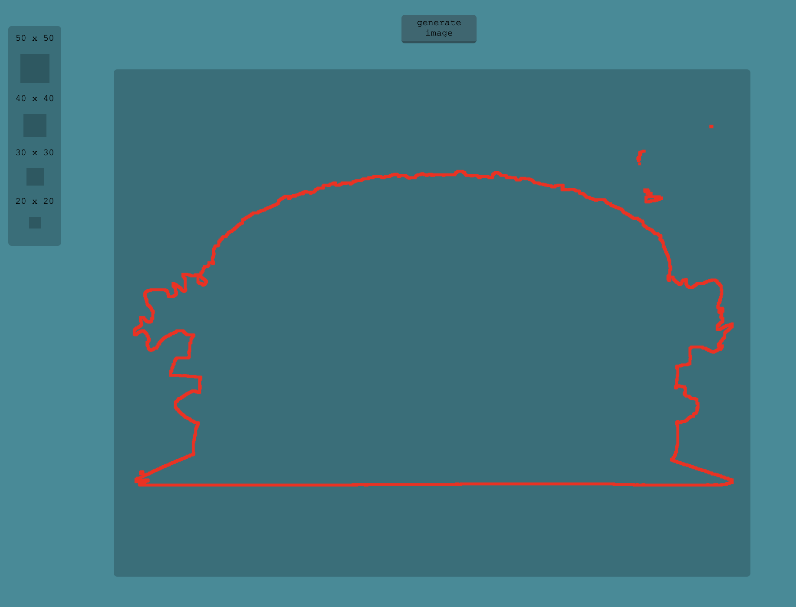
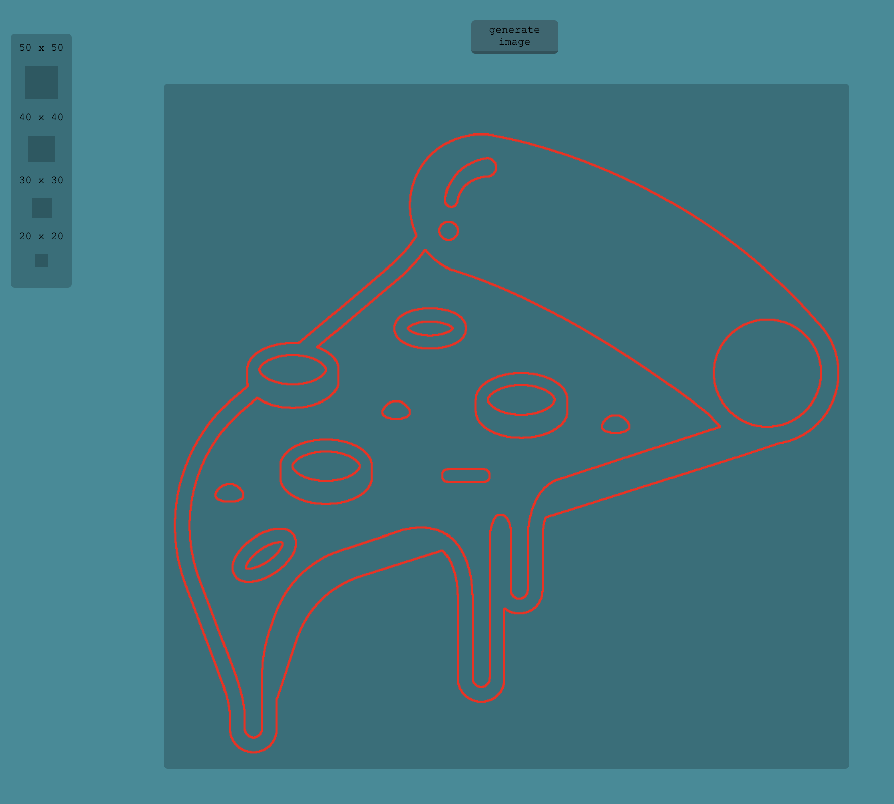

# PNG Doctor

Built With
* nodejs
* fs
* jimp
* express

A tool that inspects alpha values of png pixels to identify and remove image artifacts

detects edges and sends data to front end for visualization

  

  

  

To Do

* set x and y in maybePile object instead of front end calculation