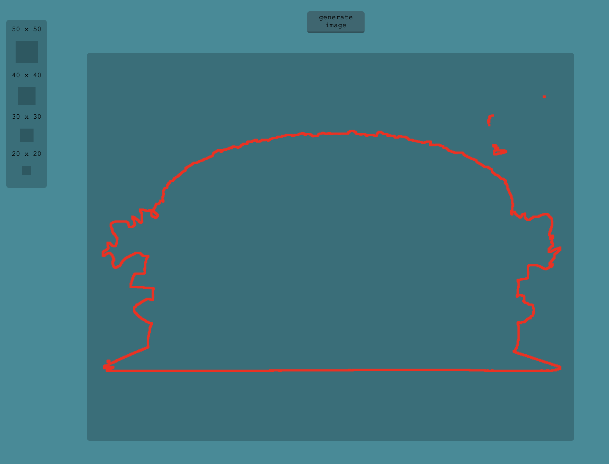

# PNG Doctor

Built With
* nodejs
* fs
* jimp
* express

A tool that inspects alpha values of png pixels to identify and remove image artifacts

detects edges and sends data to front end for visualization

 
